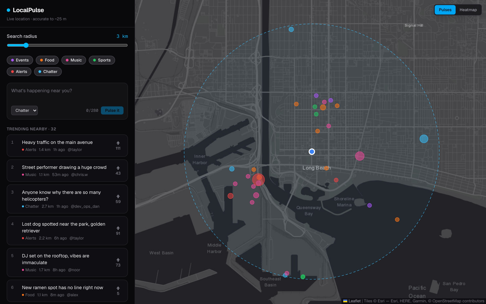
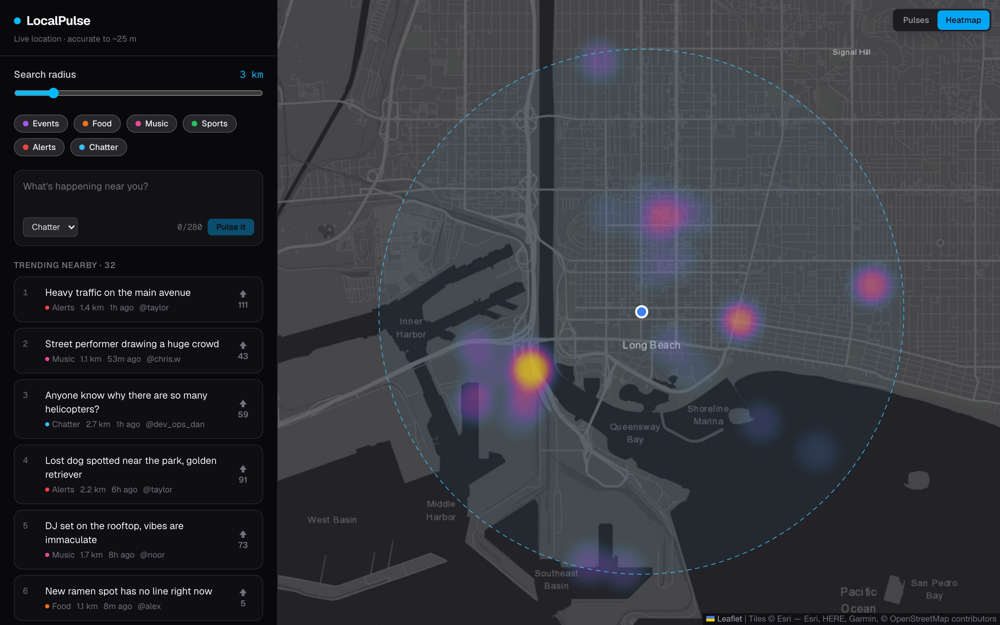
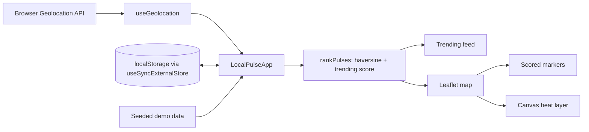

# LocalPulse

[](https://github.com/dipak5501/localpulse/actions/workflows/ci.yml)
[](https://github.com/dipak5501/localpulse/actions/workflows/deploy.yml)

**A live map of what's trending around you.** LocalPulse finds your location and shows nearby events, food spots, music, sports and alerts, ranked by a location-aware trending algorithm and visualised as markers or a heatmap.

**[Live demo →](https://dipak5501.github.io/localpulse/)** (allow location access, or it defaults to Long Beach, CA)

| Pulses | Heatmap |
| ------ | ------- |
|  |  |

## Features

- **Live geolocation** via `watchPosition`, with a graceful fallback when access is denied or unavailable
- **Radius search** (1 to 15 km) using great-circle (haversine) distance
- **Location-aware trending ranking** that balances upvotes, recency and proximity
- **Two map views:** scored markers (size = trending score) or a custom canvas **heatmap** of hotspots
- **Post, upvote and filter by category**; your posts and votes persist across reloads and sync between tabs
- **Responsive and accessible:** works on mobile, labelled controls, `aria-pressed` / `radiogroup` semantics

## How trending works

Each pulse gets a score inspired by Hacker News ranking, weighted by distance:

```
score = (upvotes + 1) / (ageHours + 2) ^ 1.5  ×  (1 − 0.5 × min(distance / radius, 1))
```

- **Time decay:** older posts sink unless they keep getting votes. The gravity value `1.5` controls how quickly.
- **Proximity:** a post at the edge of your radius scores half as much as an identical one next to you.

Implementation: [`src/lib/trending.ts`](src/lib/trending.ts), covered by unit tests.

## Architecture



- **`src/lib`** holds pure, framework-free logic (geo math, ranking, heatmap colouring, storage validation). It has no React imports, so it's fast to unit test and could run on a server unchanged.
- **The heatmap is hand-written** rather than a plugin: each point stamps a pre-blurred circle onto a canvas at its weight as opacity, then the alpha channel is recoloured through a 256-entry palette ([`HeatLayer.tsx`](src/components/HeatLayer.tsx), [`heatmap.ts`](src/lib/heatmap.ts)).
- **Persistence is hydration-safe:** [`useLocalStorage`](src/hooks/useLocalStorage.ts) is built on `useSyncExternalStore`, validates stored data before use, syncs across tabs, and falls back to memory when storage is blocked.

## Database (Supabase + PostGIS)

The backend schema is ready in [`supabase/migrations`](supabase/migrations):

- `pulses` stores a PostGIS `geography(point)` with a **GiST index**, so radius queries use `ST_DWithin` on the index instead of scanning every row.
- `nearby_pulses(lat, lng, radius_km)` is an RPC returning pulses in range with their distance.
- `pulse_votes` has a composite primary key (**one vote per user**) and a trigger that keeps a denormalised `upvotes` counter in sync.
- **Row-level security:** anyone can read; signed-in users can only post, vote and delete as themselves, and can't seed fake upvotes.
- Inserts are broadcast over **Supabase Realtime** for live updates.

The migration is tested against a real Postgres + PostGIS engine running in-process via [PGlite](https://pglite.dev), so RLS policies, the trigger and the radius function are verified in CI without a hosted database ([`supabase/tests`](supabase/tests/migration.test.ts)).

## Testing

| Layer | Tooling | What's covered |
| ----- | ------- | -------------- |
| Unit | Vitest | Geo math, trending, heatmap palette, storage validation, formatting |
| Database | Vitest + PGlite/PostGIS | Radius search, age filter, vote trigger, RLS policies, constraints |
| End-to-end | Playwright (desktop + mobile) | Live location, fallback, radius, filters, posting + reload, upvotes, heatmap |

CI runs lint, type-check, unit/database tests, a production build and the Playwright suite on every push. Merges to `main` deploy a static build to GitHub Pages.

## Tech stack

Next.js 16 (App Router) · React 19 · TypeScript · Tailwind CSS 4 · Leaflet / react-leaflet · Supabase (Postgres + PostGIS) · Vitest · Playwright · GitHub Actions

## Getting started

```bash
npm install
npm run dev          # http://localhost:3000
npm test             # unit + database tests
npm run test:e2e     # Playwright (starts the dev server if needed)
npm run lint
npm run typecheck
npm run build
```

## Roadmap

- [x] Map, geolocation, radius search, location-aware trending ranking
- [x] Heatmap view, local persistence, end-to-end tests, live demo
- [x] Supabase schema with PostGIS, RLS and tested migrations
- [ ] Connect the app to Supabase with anonymous sign-in
- [ ] Realtime updates so new pulses appear for everyone instantly
- [ ] Photo attachments via Supabase Storage
