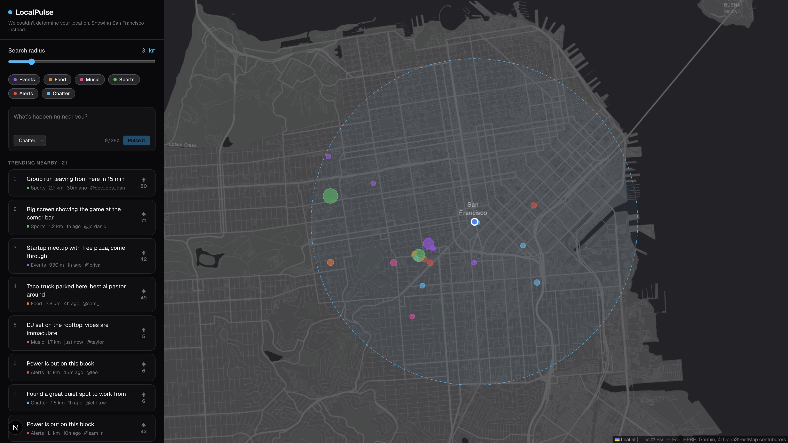

# LocalPulse

**A live map of what's trending around you.** LocalPulse finds your location and shows nearby events, food spots, music, sports and alerts, ranked by a location-aware trending algorithm.



## Features

- **Live geolocation** with a graceful fallback when location access is denied or unavailable
- **Radius search** (1 to 15 km) using great-circle (haversine) distance
- **Location-aware trending ranking** that balances upvotes, recency and proximity
- **Interactive dark map** where marker size reflects trending score; click a post to fly to it
- **Category filters**, upvotes and posting a pulse at your current location
- Accessible controls (labelled inputs, `aria-pressed` toggles, keyboard friendly)

## How trending works

Each pulse gets a score inspired by Hacker News ranking, weighted by distance:

```
score = (upvotes + 1) / (ageHours + 2) ^ 1.5  ×  (1 − 0.5 × min(distance / radius, 1))
```

- **Time decay:** older posts sink unless they keep getting votes. The gravity value `1.5` controls how quickly.
- **Proximity:** a post at the edge of your radius scores half as much as an identical one next to you.

The implementation lives in [`src/lib/trending.ts`](src/lib/trending.ts) and is covered by unit tests.

## Tech stack

| Layer    | Choice                                   |
| -------- | ---------------------------------------- |
| Frontend | Next.js 16 (App Router), React 19, TypeScript |
| Styling  | Tailwind CSS 4                           |
| Maps     | Leaflet + react-leaflet, Esri dark basemap |
| Testing  | Vitest                                   |
| CI       | GitHub Actions (lint, type-check, test, build) |

## Project structure

```
src/
  app/                 Next.js routes and global styles
  components/          UI: map, feed, filters, post form
  hooks/               useGeolocation (watchPosition + fallback)
  lib/                 Pure, tested logic: geo math, trending, formatting, demo data
```

Domain logic in `src/lib` has no React dependencies, so it's easy to test and reuse on the server.

## Getting started

```bash
npm install
npm run dev        # http://localhost:3000
npm test           # unit tests
npm run lint
npm run build
```

## Roadmap

- [x] Map, geolocation, radius search, trending ranking, posting (local demo data)
- [ ] Persist pulses in Supabase Postgres with PostGIS radius queries
- [ ] Real-time updates so new pulses appear for everyone instantly
- [ ] Heatmap layer for hotspots
- [ ] Authentication and user profiles
- [ ] End-to-end tests with Playwright, deployed demo on Vercel
